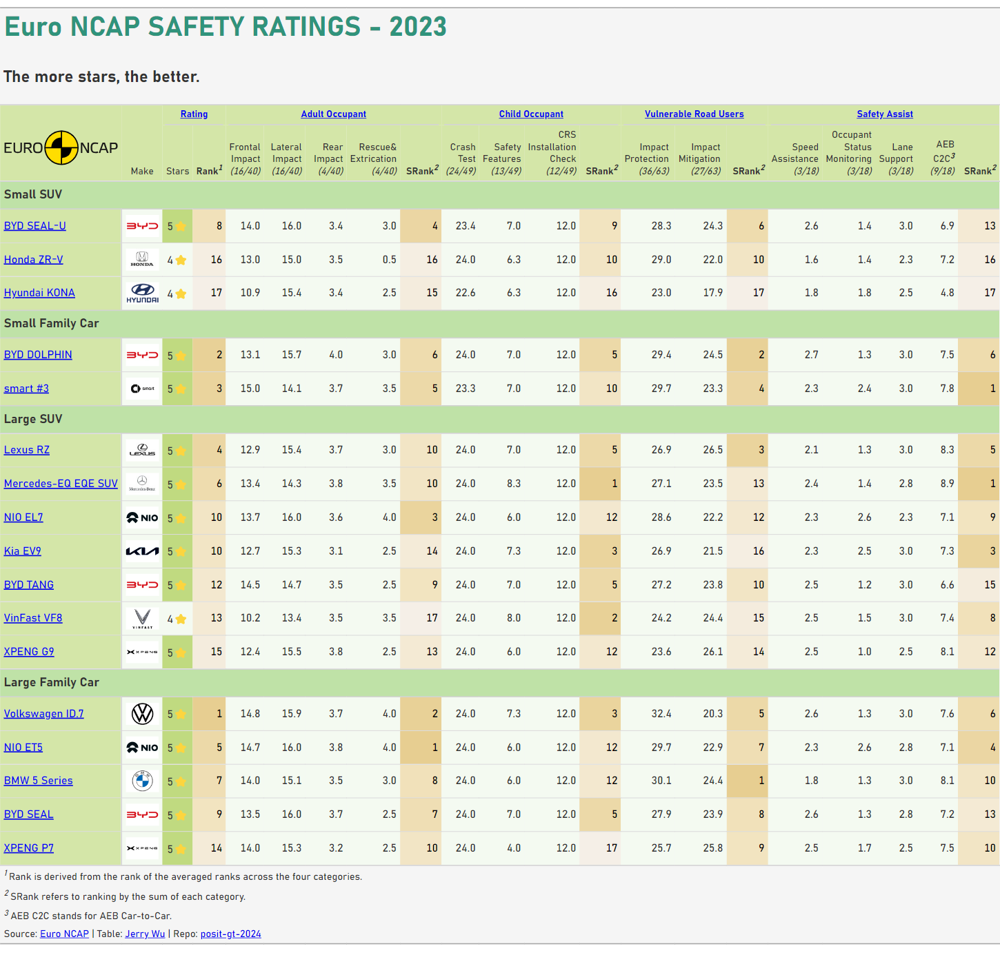

# Euro NCAP Safety Ratings - 2023
This repository represents my submission for the [2024 Table Contest](https://posit.co/blog/announcing-the-2024-table-contest/). Its objective is to demonstrate the integration of the [great-tables 0.7.0](https://github.com/posit-dev/great-tables) and [Polars 0.20.31](https://github.com/pola-rs/polars) packages in Python. The goal is to create a table displaying the ratings of 17 cars from Euro NCAP for the year 2023.

### Final table

  

### Final table in HTML
https://jrycw.quarto.pub/euroncap-2023/

### Quick preview
https://github.com/jrycw/posit-gt-2024/assets/67060418/66a81280-5ad9-4cd7-a9b4-1c03c0419c1c

### Full tutorial
https://jrycw.github.io/posit-gt-2024/
